# Book Network 

<br>

## Screens

### Register Page 
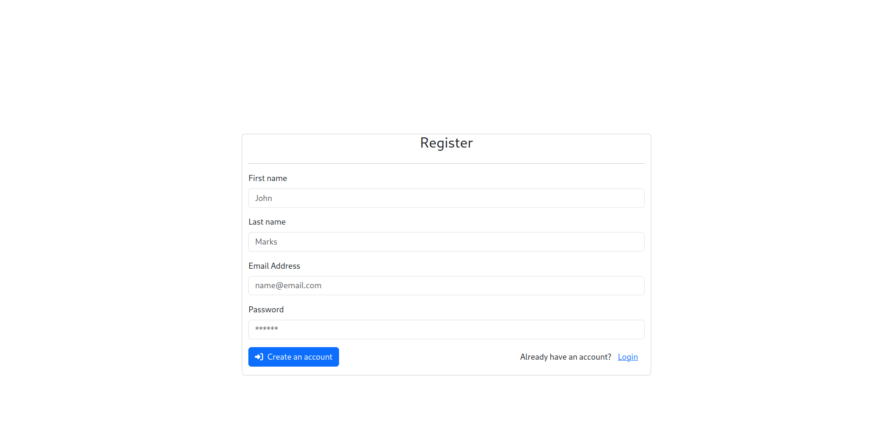

### Login Page 
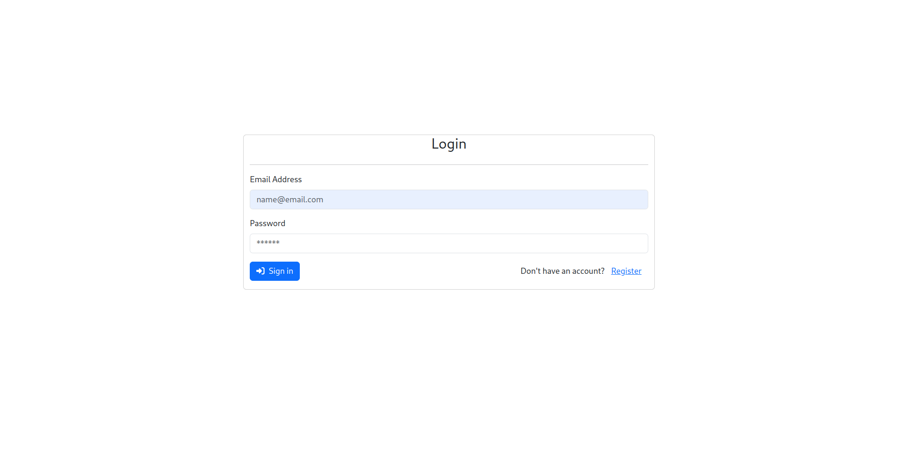

### Verify Account 
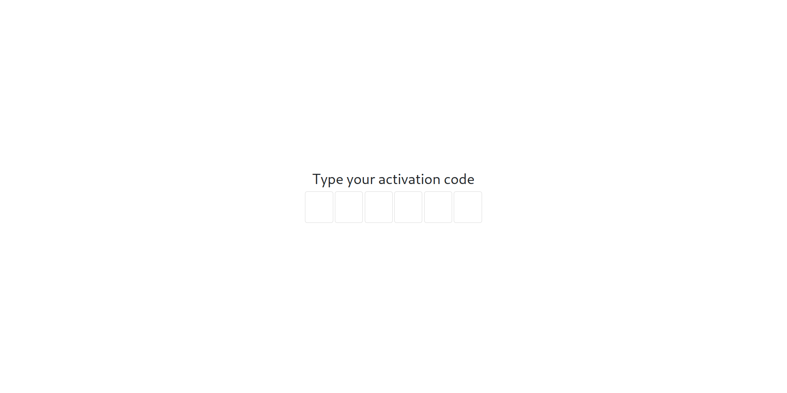

### Book List Empty (HOME)
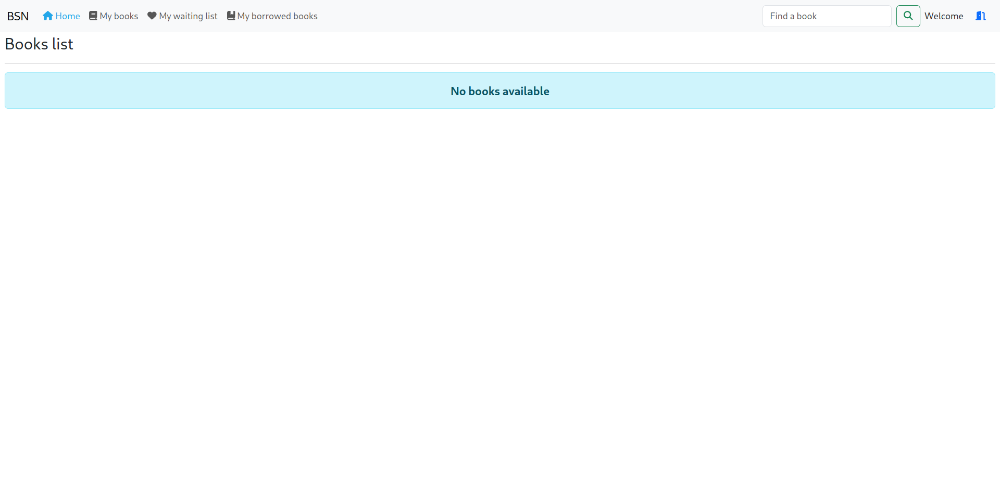

### My Book List Empty
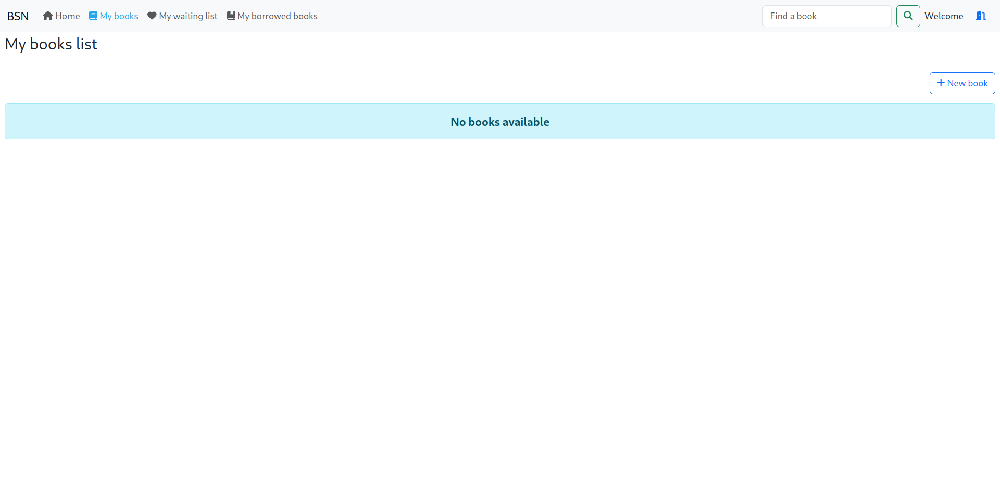

### New Book
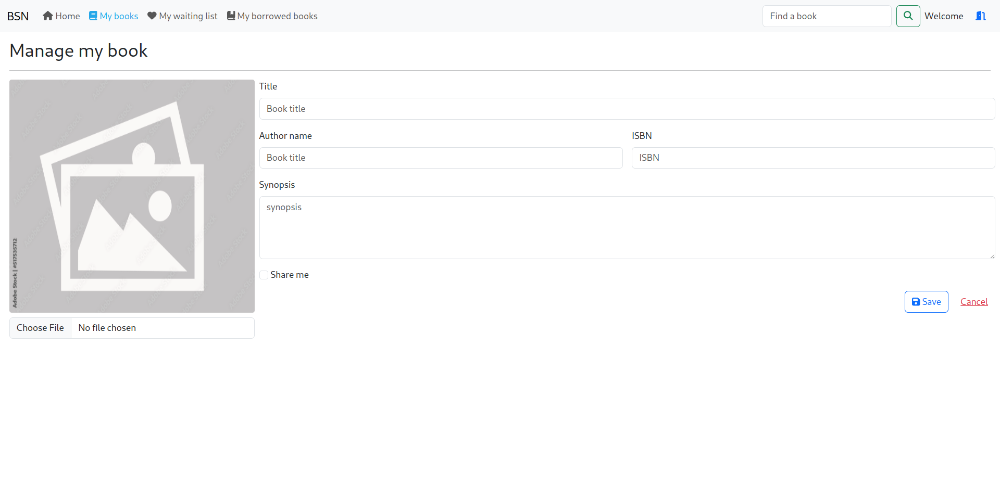

### My Book List
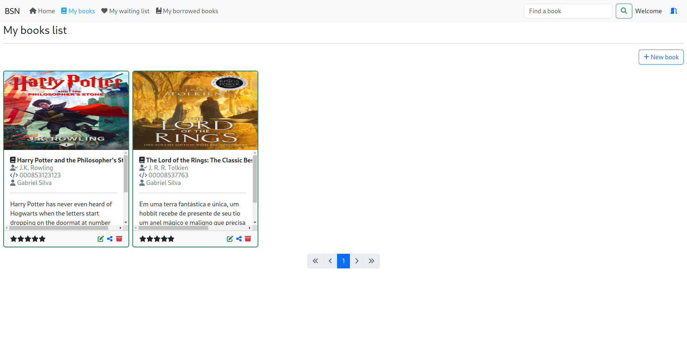

### Book List With Books (HOME)
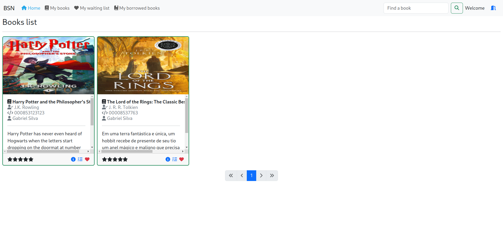

### Borrowed Books
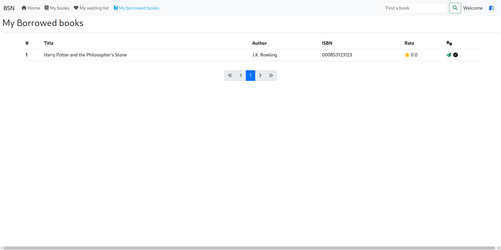

### Feedback Book Before Return
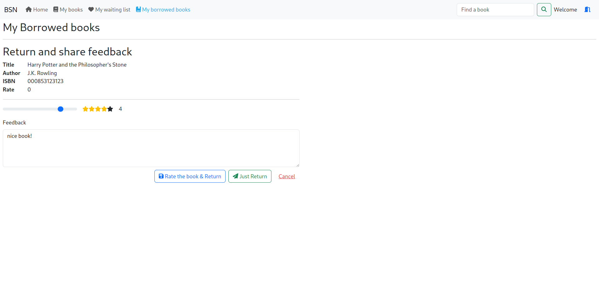

### Returned Borrowed Books
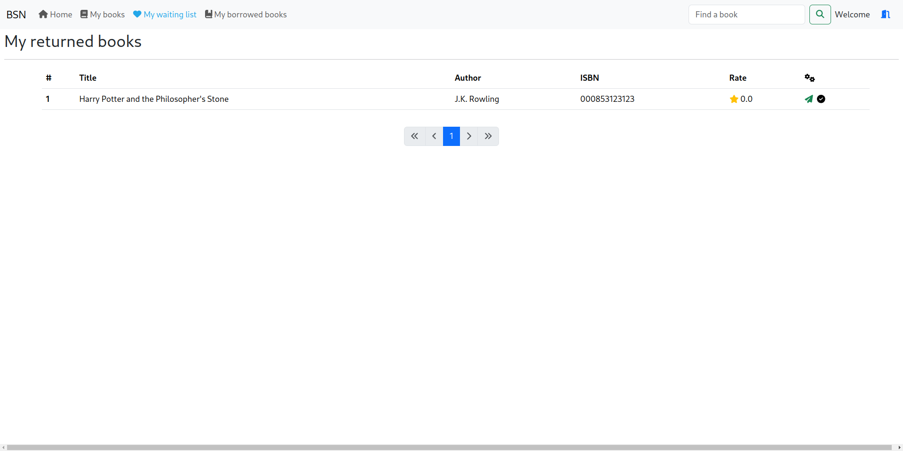

## 1. backend

- Init docker compose

```sh
# init postgres
docker-compose up
# init spring boot
./mvnw spring-boot:run
```

## 2. frontend

```sh
    # enter the ui project 
    cd book-network-ui
    # install the packages
    npm i
    # init server
    ng serve
```

## Doc Api
